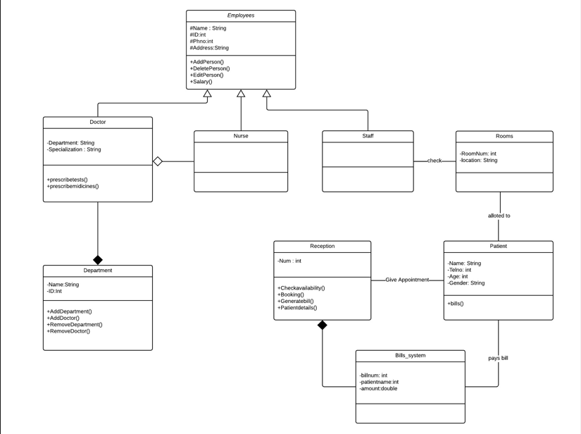

# Hospital Management System

## General Idea
The **Hospital Management System** is a software project designed to manage employee data, patient details, and appointment bookings. It provides a streamlined interface for both administrative and reception tasks but is not a complete hospital system.

## Features
### Admin Access
Admins have extensive control over the system, including:
- Managing employee data (doctors, nurses, and receptionists):
  - Insert, update, or delete employee records.
  - Edit salary details.
- Accessing and modifying indoor patient details.
- Editing or deleting patient data.

### Receptionist Access
Receptionists have access to functionalities specific to their role:
- Viewing their profile.
- Accessing indoor patient details (similar to admin).
- Viewing doctor appointments.
- Generating bills.
- Changing their account password.

## Technical Details
- **Database**: The system uses **Microsoft Access 2007** for data storage.
- **Technology**: The UI is built using **JavaFX** and **SceneBuilder**.
- **Database Connection**:
  - `java.sql.Connection`
  - `java.sql.DriverManager`
  - `java.sql.PreparedStatement`
  - `java.sql.ResultSet`
  - `java.sql.Statement`
- **Dependencies**: The `ucanaccess` folder includes JAR files for Microsoft Access database connection (not included in JDK).

## Development Notes
- The project consists of **11 main classes** (excluding controllers).
- UML diagrams omit:
  - Controller classes.
  - Getter and setter methods.

## UML Diagram
The UML diagram below outlines the core structure and relationships within the system, focusing on the main classes:

